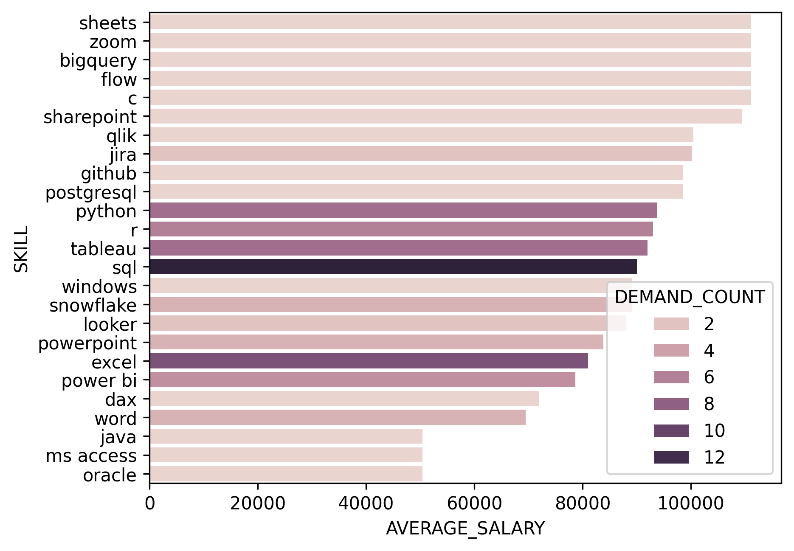

# Introduction
Dive into the data job market in the Philippines! 🏙️, focusing on key locations (Manila, Taguig, Makati), top companies, and required skills. Uncover in-demand tools like SQL, Excel, Tableau 📊, Python 🐍, and R 📈, and identify skills that boost both salary and demand. Perfect for career planning or upskilling! 🚀

Check the project here: [SalaryDatabase](ProjectFiles/SalaryDatabase.sql)
# Background 
This SQL query set aims to answer key questions for aspiring Data Analysts in the Philippines:

- What are the highest paying roles for Data Analysts in the Philippines?
- What skills are required for high-paying Data Analyst jobs?
- What are the most sought-after skills in high-paying Data Analyst roles?
- Which skills correlate with the highest salaries?
- What are the most optimal skills to learn based on demand and salary?                                   
# Tools I Used
Here are the tools I used for these SQL queries:

- **🧑‍💻 Oracle SQL:** Used to retrieve job posting information, company details, and salary data from the database.
- **🔄 GitHub:** Managed version control, collaboration, and storing of SQL queries and related scripts.
- **📊 Matplotlib:** Analyzed the results and created visualizations to gain insights on salary trends, skill demand, and optimal career paths for data analysts.
# The Analysis
### 1. Highest paying roles for Data Analysts in the Philippines
```sql
SELECT job_title, job_location, com_dim.name AS company_name, salary_year_avg
FROM job_postings_fact job_post
INNER JOIN company_dim com_dim ON job_post.company_id = com_dim.company_id
WHERE job_title_short = 'Data Analyst'
      AND salary_year_avg IS NOT NULL
      AND (job_location LIKE 'Manila%' OR job_location LIKE 'Taguig%' OR job_location LIKE 'Makati%')
      AND job_country = 'Philippines'
ORDER BY salary_year_avg DESC
FETCH FIRST 10 ROWS ONLY; 
```
- Role Variability: The "Data Analyst" role appears frequently across multiple companies, indicating its high demand in the market.
- Key Locations: Manila and Taguig are hotspots for these high-paying roles, with many companies operating in these cities.
- Competitive Salaries: Companies like Canva and Dialpad are among the top payers, offering average yearly salaries of over PHP 110,000.
### 2. Skills that are required for high-paying Data Analyst jobs
```sql
WITH cte_top_jobs AS(
    SELECT job_id, job_title, job_location, com_dim.name AS company_name, salary_year_avg
    FROM job_postings_fact job_post
    INNER JOIN company_dim com_dim ON job_post.company_id = com_dim.company_id
    WHERE job_title_short = 'Data Analyst'
          AND salary_year_avg IS NOT NULL
          AND job_location LIKE '%Philippines' 
          AND job_country = 'Philippines'
    ORDER BY salary_year_avg DESC
)
SELECT job_title, job_location, company_name, sk_dim.skills AS skill, salary_year_avg
FROM cte_top_jobs cte_jobs
INNER JOIN skills_job_dim sk_job ON sk_job.job_id = cte_jobs.job_id
INNER JOIN skills_dim sk_dim ON sk_job.skill_id = sk_dim.skill_id
ORDER BY salary_year_avg DESC;
```
- Key Skills: SQL, Python, and BigQuery are among the most sought-after skills, especially for data analysts.
- Skill-Salary Correlation: Mastery in programming languages like Python and R is often associated with high-paying roles, particularly in companies like Canva.
- Regional Trends: Metro Manila remains a hub for top-paying jobs, emphasizing the importance of these skills for competitive roles in the region.
### 3. Most sought-after skills in high-paying Data Analyst roles
```sql
WITH cte_skills_info AS(
    SELECT sk_job_dim.job_id AS job_id,
           sk_dim.skill_id AS skill_id,
           sk_dim.skills AS skill_name
    FROM skills_job_dim sk_job_dim
    INNER JOIN skills_dim sk_dim ON sk_job_dim.skill_id = sk_dim.skill_id
)
SELECT MAX(cte_info.skill_id) AS skill_id, cte_info.skill_name, COUNT(job_post.job_id) AS posting_count
FROM cte_skills_info cte_info
LEFT JOIN job_postings_fact job_post ON cte_info.job_id = job_post.job_id
WHERE job_title_short = 'Data Analyst' AND job_post.job_location LIKE '%Philippines' 
GROUP BY cte_info.skill_name
ORDER BY posting_count DESC;
```
- Excel Dominance: Excel tops the list with 1,945 postings, showcasing its essential role in data analysis tasks.
- Programming Skills: SQL and Python are highly sought after, with 1,535 and 841 postings respectively, reflecting their importance in data manipulation and analysis.
- Visualization Tools: Power BI and Tableau are in high demand, with over 800 postings each, indicating a strong focus on data visualization capabilities.
### 4. Skills that correlate with the highest salaries
```sql
WITH cte_top_salary AS(
    SELECT skill_id, job_title_short, salary_year_avg
    FROM job_postings_fact
    INNER JOIN skills_job_dim sk_job ON job_postings_fact.job_id = sk_job.job_id
    WHERE salary_year_avg IS NOT NULL AND job_title_short = 'Data Analyst' AND job_location LIKE '%Philippines'
    ORDER BY salary_year_avg DESC
)
SELECT sk_dim.skills AS skill, ROUND(AVG(salary_year_avg),0) AS average_salary
FROM cte_top_salary
INNER JOIN skills_dim sk_dim ON cte_top_salary.skill_id = sk_dim.skill_id
GROUP BY skill
ORDER BY average_salary DESC;
```
- Cloud-based tools and platforms like BigQuery and SharePoint correlate with the highest salaries, indicating demand for expertise in managing large-scale data operations.
- Collaboration and project management tools such as Jira and Zoom also rank high, reflecting the importance of teamwork and productivity tools.
- Technical database skills, including proficiency in PostgreSQL, command premium salaries, emphasizing the need for strong data management abilities.
### 5. Most optimal skills to learn based on demand and salary 
```sql
WITH cte_top_salary AS(
    SELECT skill_id, job_title_short, salary_year_avg
    FROM job_postings_fact
    INNER JOIN skills_job_dim sk_job ON job_postings_fact.job_id = sk_job.job_id
    WHERE salary_year_avg IS NOT NULL AND job_title_short = 'Data Analyst' AND job_location LIKE '%Philippines'
    ORDER BY salary_year_avg DESC
)
SELECT sk_dim.skills AS skill, COUNT(sk_dim.skills) AS demand_count, ROUND(AVG(salary_year_avg),0) AS average_salary
FROM cte_top_salary
INNER JOIN skills_dim sk_dim ON cte_top_salary.skill_id = sk_dim.skill_id
GROUP BY skill
ORDER BY average_salary DESC, demand_count DESC
FETCH FIRST 25 ROWS ONLY
```

<p align="center">
  *A bar graph visualizing the most optimal skills based on salary and demand.*
</p>

- SQL is the most in-demand skill, offering a strong balance of high demand and competitive salary.
- Python and Tableau stand out as highly rewarding technical skills, combining high salaries with significant demand.
- Power BI and Snowflake are valuable for data visualization and cloud-based data management, respectively, providing good salary opportunities with moderate demand.
# What I Learned
Starting with SQL has been an exciting journey, helping me learn how to work with data and share insights.
- **🔗 Data Relationships:** Understanding how tables connect is foundational for writing meaningful SQL queries.
- **🧩 Complex Queries:** Mastering techniques like subqueries and CTEs unlocks the ability to handle intricate data problems effectively.
- **📊 Data Visualization:** Leveraging tools like Matplotlib complements SQL by transforming data insights into compelling visuals.


